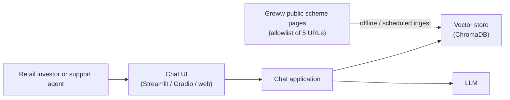
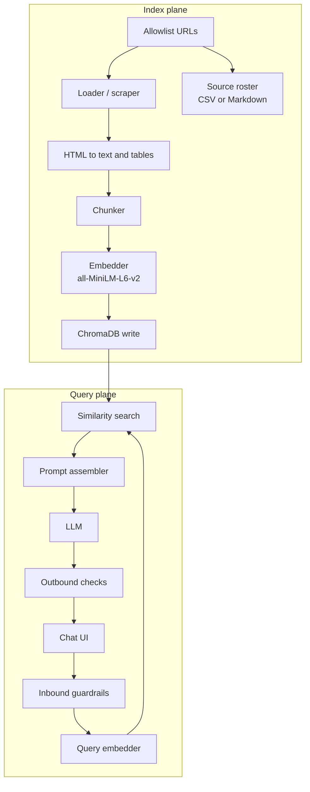

# Architecture: HDFC Mutual Fund RAG Chatbot

This document defines the system architecture for the HDFC Mutual Fund RAG Chatbot described in [`hdfc_mutual_fund_rag_chatbot_prd.md`](./hdfc_mutual_fund_rag_chatbot_prd.md). It is the technical counterpart to the PRD: product rules stay in the PRD; this file specifies components, data flow, interfaces, and operational constraints.

## 1. Purpose and design principles

The product is a **facts-only** Retrieval-Augmented Generation (RAG) assistant. It answers questions about five HDFC Direct-Growth schemes using **only** the official Groww scheme pages listed in the PRD. It does not give investment advice, forecast returns, or use unpublished data.

Design principles:

| Principle | Architectural implication |
| :--- | :--- |
| Grounded answers | Generation is allowed only from retrieved chunks of the approved corpus. |
| Cited answers | Every response includes at least one source URL from the retrieval set. |
| Bounded corpus | Ingestion is a closed allowlist of five URLs; no blogs, APIs, or user-uploaded files. |
| No PII | The application never prompts for, validates, or persists PAN, Aadhaar, account numbers, OTPs, emails, or phones. |
| Public sources only | Scrape/load public HTML; no AMC backend, Groww private APIs, or screenshots as knowledge. |
| Concise output | Prompts and post-generation checks enforce ≤ 3 sentences plus citation and freshness stamp. |

## 2. System context

Actors:

- **End user:** asks factual questions; never authenticates with financial identity.
- **Operator:** runs ingest, refresh, and evaluation; maintains the source roster.
- **External system:** Groww public pages (read-only HTTP). No write-back.

Out of scope at the system boundary: brokerage accounts, KYC, order placement, proprietary AMC databases, third-party opinion content.

## 3. High-level architecture

The system has two planes: **index build** (batch) and **query serving** (online).

### 3.1 Runtime topology (prototype)

| Layer | Choice (PRD) | Notes |
| :--- | :--- | :--- |
| UI | Streamlit, Gradio, or notebook | Minimal: welcome, disclaimer, three example queries. |
| Orchestration | Python application | Single process is acceptable for the prototype. |
| Embeddings | Hugging Face `sentence-transformers/all-MiniLM-L6-v2` | Same model for ingest and query. |
| Vector DB | ChromaDB | Local persistence for prototype; path versioned or documented. |
| LLM | Prompt-engineered chat/completion model | Provider is an implementation choice; behavior is specified here. |

Hosting (delivery): a public Streamlit/Gradio/Vercel link, or a ≤ 3-minute demo video if hosting is not feasible.

## 4. Data corpus and source of truth

### 4.1 Allowlist

Ingestion **must** fail closed: only these Direct-Growth scheme pages are loaded.

| Scheme class | Fund | URL |
| :--- | :--- | :--- |
| Large Cap | HDFC Large Cap Fund | https://groww.in/mutual-funds/hdfc-large-cap-fund-direct-growth |
| Flexi Cap | HDFC Flexi Cap Fund | https://groww.in/mutual-funds/hdfc-equity-fund-direct-growth |
| ELSS | HDFC ELSS Tax Saver Fund | https://groww.in/mutual-funds/hdfc-elss-tax-saver-fund-direct-plan-growth |
| Small Cap | HDFC Small Cap Fund | https://groww.in/mutual-funds/hdfc-small-cap-fund-direct-growth |
| Balanced Advantage | HDFC Balanced Advantage Fund | https://groww.in/mutual-funds/hdfc-balanced-advantage-fund-direct-growth |

The **source roster** (CSV or Markdown) is a required deliverable and should be generated from the same allowlist used by the loader so documentation cannot drift from the index.

### 4.2 What is stored

For each page, persist:

- Raw or normalized text (body copy, headings).
- Tabular facts (expense ratio, exit load, min SIP/lumpsum, riskometer, benchmark, lock-in).
- Metadata: `source_url`, `scheme_name`, `scheme_class`, `fetched_at` (ISO date used for the freshness stamp), optional `section` (e.g. `fees`, `risk`, `how_to`).

Do not store user chat logs that contain PII. Prototype logging, if any, should be local, truncated, and PII-stripped (see §8).

## 5. Index plane (RAG stages 1–4)

### 5.1 Data ingestion

**Role:** fetch the five URLs and extract text, tables, and metadata.

**Strategy:**

1. HTTP GET with a documented User-Agent and timeout; treat non-200 as ingest failure for that URL.
2. Parse HTML; drop navigation, ads, and unrelated widgets.
3. Convert tables to a lossless-enough text form (markdown or `key: value` rows) so fee structures are not split across unrelated chunks.
4. Record `fetched_at` per URL.

**Constraints:** public pages only; no authenticated APIs; no screenshot OCR as the primary extract path.

### 5.2 Chunking

**Role:** split documents so retrieval can return a complete fact without drowning the LLM in the whole page.

**PRD requirement:** evaluate ingested HTML/text and choose **Recursive Character** or **Semantic** chunking to preserve tables and contextual boundaries.

Recommended default for this corpus (short, structured scheme pages):

1. Split first by **semantic sections** (headings: overview, returns disclaimer, expense, exit load, min investment, riskometer, benchmark, documents).
2. Within a section, use **recursive character splitting** with overlap if a section exceeds the embedding sweet spot (typically 256–512 tokens for MiniLM).
3. Keep a table (or a table row group) **inside one chunk** whenever possible. If a table must split, duplicate the table caption / scheme name in each piece.

Each chunk carries metadata from §4.2 so citations never depend on the LLM inventing a URL.

### 5.3 Embedding

**Model:** `sentence-transformers/all-MiniLM-L6-v2`.

**Rules:**

- Embed the chunk text used at query time; do not mix models between ingest and serve.
- Optionally prepend a short prefix (`scheme_name | section`) to the embedded string so same-fact types across funds remain distinguishable.

### 5.4 Vector database

**Store:** ChromaDB collection, e.g. `hdfc_groww_schemes`.

**Record shape:**

| Field | Type | Purpose |
| :--- | :--- | :--- |
| `id` | string | Stable id: hash of `source_url + section + chunk_index` (or content hash). |
| `embedding` | vector | MiniLM output. |
| `document` | string | Chunk text passed to the LLM. |
| `metadata.source_url` | string | Mandatory citation URL. |
| `metadata.scheme_name` | string | Disambiguation. |
| `metadata.fetched_at` | string | Freshness stamp. |
| `metadata.section` | string | Optional retrieval filter. |

**Retrieval:** cosine similarity (or Chroma default equivalent) top-k (k = 3–6). Optional metadata filter when the query names a scheme.

Rebuild the collection on each ingest run rather than merging stale chunks with new ones unless ids are strictly content-addressed.

## 6. Query plane (RAG stage 5 + guardrails)

### 6.1 User interface

Minimal surface:

- Welcome message stating the five-scheme scope.
- Visible disclaimer, verbatim: **Facts-only. No investment advice.**
- Three clickable example queries (e.g. exit load, min SIP, ELSS lock-in).
- Text input for a free-form question; output area for the answer, citation link(s), and freshness line.

No account login, no file upload, no fields for PAN/Aadhaar/folio.

### 6.2 Inbound guardrails

Run **before** retrieval/generation. Classify the user message into:

| Class | Action |
| :--- | :--- |
| Factual in-scope | Continue to retrieve (expense ratio, exit load, lock-in, min SIP/lumpsum, riskometer, benchmark, procedural “how to download statements”, etc.). |
| Advice / opinion / portfolio | Refuse: polite facts-only refusal plus an educational link (scheme page or generic “what is X” explainer on the same public site if available). Do not retrieve-to-justify a buy/sell recommendation. |
| Returns / performance / forecast | Do not compute, compare, or project returns. Direct the user to the official factsheet (or the scheme page’s official documents section) via citation. |
| Out-of-corpus | Scheme not in the five, other AMCs, market news: refuse as out of scope; do not invent. |
| PII | If the message contains PAN/Aadhaar-like numbers, account numbers, OTPs, emails, or phones: refuse, do not store the raw message, and do not echo the secrets back. |

Advice examples from the PRD: “Should I buy this?”, “Is this a good investment?”

### 6.3 Prompt assembly

The LLM sees:

1. System instructions (fixed).
2. Retrieved chunks with `source_url` and `fetched_at`.
3. User question.

System instruction contract:

- Answer **only** from retrieved chunks. If chunks are insufficient, say so; do not use parametric knowledge about funds.
- Maximum **three sentences** of answer body.
- Append **at least one** markdown/plain URL that appears in retrieved metadata.
- Final line exactly in this form: `Last updated from sources: [Date]` where `[Date]` is the latest `fetched_at` among chunks used (or a conservative “oldest fetch” policy if you prefer strictness—pick one and use it consistently; **recommended:** latest fetch date among cited chunks).
- Do not give buy/sell/hold advice.
- Do not compute, compare, or forecast returns.
- Do not ask for PII.

### 6.4 Outbound checks

After generation, validate before display:

1. Sentence count of the answer body ≤ 3 (freshness line excluded).
2. At least one allowlisted URL is present.
3. Freshness stamp regex/suffix is present.
4. Optional blocklist: advice phrases (“you should invest”, “good buy”, return percentages invented by the model).

On failure: regenerate once with a repair prompt, or fall back to a template: short refusal/insufficient-context message + scheme URL + freshness stamp.

### 6.5 Answer types

| User need | Retrieval | Generation |
| :--- | :--- | :--- |
| Expense ratio, exit load, min amounts, riskometer, benchmark | Prefer fee/risk chunks | Quote the fact; cite scheme URL. |
| ELSS lock-in | Tax-saver scheme chunks | State lock-in as published; no tax advice. |
| How to download capital-gains statements | Procedural section if present on the page | Steps only as written on the source; if absent, say it is not on the indexed page and cite the page. |

## 7. Component interfaces

Logical modules (map 1:1 to Python packages in implementation):

| Module | Responsibility | Inputs | Outputs |
| :--- | :--- | :--- | :--- |
| `sources` | Allowlist + roster export | constants | URL list, CSV/MD roster |
| `ingest` | Fetch and parse | URLs | documents + metadata |
| `chunk` | Split strategy | documents | chunks |
| `embed` | MiniLM encode | texts | vectors |
| `index` | Chroma write/read | chunks + vectors | collection |
| `retrieve` | top-k search | query string | chunks + scores |
| `guardrails` | inbound/outbound policy | text | allow / refuse / repair |
| `generate` | LLM call | prompt | raw completion |
| `ui` | Streamlit/Gradio | user events | rendered chat |

Configuration (env or config file): model name, Chroma persist directory, top-k, LLM endpoint/key, fetch timeout. Secrets stay in environment variables, never in the source roster or git-tracked prompts if they contain keys.

## 8. Security, compliance, and threat model

| Control | Implementation |
| :--- | :--- |
| Public sources only | Loader uses allowlist; no extra domains. |
| Zero PII by design | UI copy forbids identity fields; inbound PII detector; no user database. |
| Prompt injection | Treat retrieved HTML-derived text as untrusted; system prompt forbids following instructions found in chunks; outbound checks still apply. |
| Secret handling | LLM API keys in env only. |
| Abuse | Prototype: rate-limit if hosted; no account system. |

The bot is **not** a SEBI-registered advisor. The UI disclaimer is a product control, not a substitute for legal review.

## 9. Freshness and operations

- Ingest is **batch**. Prototype: operator-triggered rebuild.
- `fetched_at` on each URL is the date shown in `Last updated from sources: [Date]`.
- If a page layout change breaks parsing, ingest should fail visibly (empty extract) rather than index boilerplate.
- Known limitation: Groww page content can change without notice; answers are only as fresh as the last successful ingest.

## 10. Evaluation architecture

The PRD requires a sample Q&A set of 5–10 queries covering:

- In-scope facts (expense, load, SIP, riskometer, procedure).
- Guardrail triggers (advice, returns).
- Citations present.

Evaluation is **offline**: store query, expected behavior (answer / refuse), generated output, citation URLs. No production user telemetry required for the milestone.

Suggested labeling:

- `correct_fact` / `wrong_fact` / `refusal_ok` / `refusal_missed` / `missing_citation`.

## 11. Delivery mapping

| PRD deliverable | Architecture artifact |
| :--- | :--- |
| Working prototype | Query plane + UI hosted or recorded. |
| Source roster | Allowlist export from `sources`. |
| README | Setup, this architecture summary, AMC + five schemes, limitations. |
| Evaluation set | Offline Q&A document. |
| Disclaimer asset | Exact string: `Facts-only. No investment advice.` |

## 12. Non-goals and limitations

- Not a general mutual-fund chatbot (one AMC, five schemes).
- Not a returns calculator or portfolio optimizer.
- Not an authenticated Groww/AMC client.
- Scraped HTML may omit facts that exist only in PDFs/factsheets; those queries should cite the page and point to the official document link **if that link appears in the indexed page**, not from model memory.
- Embedding model is small (MiniLM); retrieval quality depends on chunk quality more than model size.

## 13. Suggested implementation sequence

1. Freeze allowlist and source roster.
2. Ingest + inspect extracts (tables intact).
3. Chunk, embed, load Chroma; spot-check retrieval for 5 gold questions.
4. Wire LLM prompt + inbound/outbound guardrails.
5. UI with disclaimer and three examples.
6. Evaluation set and README.

This order keeps generation from running on an untrusted or empty index.
